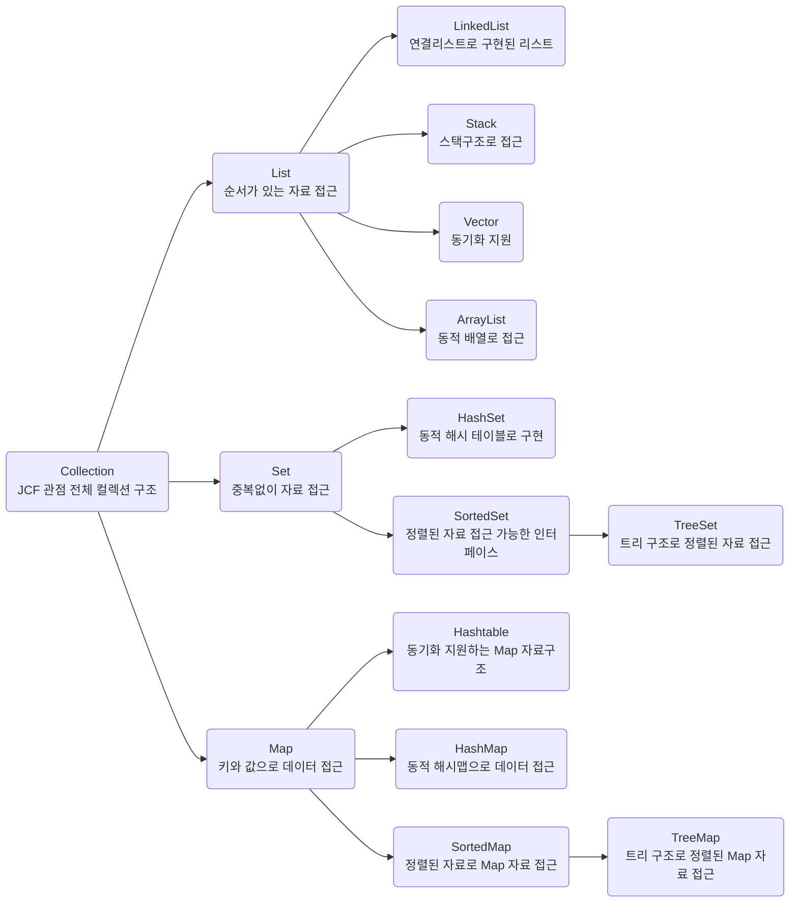

# TIL Template

## 날짜: 2024 05 22
### 스크럼
- x

### 새로 배운 내용
#### 주제 : Collectioin, 예외처리 
## Collection

→ 자바에서 데이터 구조를 다루기 위해 제공되는 클래스와 인터페이스 집합. 데이터 구조로 표현되며, 데이터의 CRUD를 효율적으로 할 수 있도록 돕는다. 자료구조 제공

- SET 인터페이스
    - 중복을 허용하지 않는 컬렉션
    - HashSet, LinkedHashSet, TreeSet 등
- List 인터페이스
    - 순서가 있는 컬렉션, 중복 요소를 허용
    - ArrayList, LinkedList, Vector, Stack 등
- Queue 인터페이스
    - FIFO 구조를 가진다.
    - LinkedList, PriorityQueue 등
- Map 인터페이스
    - 키와 값 쌍으로 이루어진 컬렉션
    - HashMap, LinkedHashMap, TreeMap, Hashtable 등



## 예외 처리(exception handling)

→ 프로그램이 오류 상황을 만나도 종료되지 않고 대응할 수 있게 만들어준다.

→ try-catch-finally, throw 핵심요소

## throw

→ 개발자가 의도적으로 오류를 생성할 때 사용한다. try-catch로 잡을 수도 있다. 만일 try-catch 없이 throw new 만 사용했다면 해당 메서드에는 반드시 throws를 추가해야 한다.

<aside>
💡 만약 잡지 못해서 에러를 일으키면 오류는 전파돼서 이곳 저곳 에러를 일으킨다. 
오류 공 ( 메세지가 적힌 ) 을 그냥 던진다고 생각하면 된다. 공을 만들어서 던진다

</aside>

```java
throw new ExceptionType("예외 메세지");
```

### throw & try - catch

→ 에러사항을 일으키는 코드가 무조건 하나 있어야하고, 그 오류를 잡는 코드도 반드시 있어야 한다.

→ try catch finally throw ( 핵심 4가지 키워드 )

<aside>
💡 intelliJ F8 실행
command + shift + a or shift 2번 검색
control + shift + o → optimize import 키맵에서 설정
자동 import 기능은 안쓰는게 좋다.

</aside>

```java
try{
	throw new IllegalArgumentException("오류")
	
	}catch (IllegalArgumentException("오류")
```

예시)

```java
public class MainCase1Throw {
    public static void main(String[] args) throws Exception{ // 여기서는 예외를 처리하지 않겠다.
        System.out.println("Hello World!");
        throw new Exception("으악 에러다! 삐용삐용! 🚨"); //이 시점에 메서드 호출 종료!
				//System.out.println("앞에서 예외가 발생했으므로 이 문자열은 출력 될 수 없습니다!");
    }
} //개발자는 언제든 직접 예외를 발생시킬 수 있다.
```

### thorws

→ 몰라 내책임 아니야 하고 위로 던지는 것. try catch 없이 throw new만 사용했다면 해당 메서드는 반드시 throws를 추가해야한다.

static void 메서드() throws interruptedException {} → 난 이 에러를 책임지지 않겠다.

→ 위로 올려보낸다. 프로그램은 한 줄에 하나씩 실행되므로 오류는 두 개 발생하지 않는다.

각 함수에서 생길 수 있는 오류는 주석으로 반드시 명시

```java
public pcfile(String fileName) throws IOExeption {
	readfile(fileName); // IOExeption을 던질 수 있음.
}
```

### try

→ 블록 안에 예외가 발생할 가능성이 있는 코드 작성. try 블록이 끝난 뒤, 하나 이상의 catch 블록이 따라와야한다.

### catch

→ try로부터 발생한 에러를 잡아서 처리하는 애들. try한 개에 여러 객의 catch 블록을 사용할 수 있다. 

```java
try {
	// 예외가 발생할 가능성이 있는 코드
} catch (ExceptionType1 e) {
    // ExceptionType1 예외 처리 코드
} catch (ExceptionType2 e) {
    // ExceptionType2 예외 처리 코드
}
```

### finally

→ 써도되고 안써도된다. try 문이 실행되면 catch가 되던 안되던 finally는 반드시 실행된다.

ftp 연결할 때 빛을 발한다. 내 코드 외부에서 연결, 요청을 할 때 연결을 정상적으로 끊어줘야할 상황에 쓰인다.

<aside>
💡 functional api 는 거의 안쓴다.
methodA() 가 methodB()를 부르고 b가 methodC() 불렀다면 A는 caller, B는 callee,
b에서 오류가 나오면 a로 던진다(throws를 통해). b는 caller c는 callee .
a로 던져지면 a는 try catch를 하던 throws를 통해 다시 나몰라라 하든 할 수 있다.
계속 위로 올리다간 main에서 처리하거나 JVM 쪽으로 넘어간다.
만일 오류를 전파해서 아무도 안 받으면 해당하는 스레드가 종료된다. (프로그램 종료가 아님)
만일 그 스레드가 메인스레드라면 프로그램 종료가 된다.

</aside>

```java
import java.util.Scanner;

public class MainCase1Throw {
    public static void main(String[] args) {
        try {
            processInput(); // Exception 예외 클래스 발생
        } catch (Exception e) { // catch 로 처리 했으므로 main 함수에는 `throws Exception` 을 쓰지 않아도 됨 
            System.out.println("상위 메서드에서 예외를 처리합니다: " + e.getMessage());
        }
    }

    public static void processInput() throws Exception {
        Scanner scanner = new Scanner(System.in);
        System.out.println("숫자를 입력하세요:");
        String input = scanner.nextLine();

        try {
            int number = Integer.parseInt(input); // 입력받은 값을 숫자로 변환
            System.out.println("입력한 숫자는: " + number);
        } catch (NumberFormatException e) {
            // NumberFormatException 발생 시 새로운 예외를 throw
            // Exception 에러가 발생! 이 함수를 호출한 곳은 (callee는) 반드시 catch 혹은 throws 중 하나를 선택해야합니다.
            throw new Exception("유효한 숫자를 입력하지 않았습니다! 삐용삐용! 🚨"); 
        } finally {
            scanner.close(); // Scanner 리소스 해제
        }
    }
}
```

→ 위 코드를 실행해보는 것이 좋아보인다.

## Exception & Error

<aside>
💡 Throwable 클래스 계층 구조

java.lang.Object
↳ java.lang.Throwable
     ↳ java.lang.Exception
     ↳ java.lang.Error

</aside>

Exeception → 프로그램 코드에 의해 수습될 수 있는 덜 심각한 오류, 적절한 예외 처리를 통해 프로그램이 계속 실행될 수 있도록 할 수 있다. `NullPointerException`, `IoException` 등

Error → 프로그램 코드에 의해 수습될 수 없는 심각한 오류, 주로 시스템 레벨에서 발생하며 일반적으로 프로그램이 이를 복구할 수 없음. `OutofMemoryError` , `StackOverFlowError` 등 

컴파일러가 확인할 수 없는 exception 은 Unchecked Exception (runtimeException)

**예외 처리 종류**

- **Checked Exception 
(컴파일러 기준 확인 된 예외)**
    - 컴파일 시점에서 체크되는 예외로, 반드시 예외 처리를 해야 합니다. **try-catch** 블록이나 **throws** 키워드를 사용하여 처리해야 합니다. `IOException`, `SQLException` 등
- **Unchecked Exception (runtime exception)
(컴파일러 기준 확인되지 않은 예외)**
    - 실행 시점에서 발생하는 예외로, 런타임 예외(RuntimeException)의 하위 클래스입니다. 예외 처리가 강제되지 않으며, 필요에 따라 처리합니다. 우리가 알 수 없다. throws가 없다. `NullPointerException`, `ArrayIndexOutOfBoundsException` 등

<aside>
💡 Sentry같은 애들이 에러를 수집을 해준다.

→ jvm에서 로깅된 에러를 gui로 표현해주는 프로그램.

</aside>

### 논리적 에러

→ 프로그램은 실행되지만 결과가 예상한 대로 수행하지 못하는 오류, 디버깅으로 잡아낸다. ex.올바르지 않은 계산 결과, 잘못된 조건문 등

### 컴파일 에러

→ 컴파일 단계에서 코드의 문법 오류 등을 발견하여 컴파일러가 에러 메세지를 출력하는 오류. ex. 구문 오류, 세미콜론 누락 등

### 런타임 에러

→ 프로그램 실행 중 발생하는 에러로, 잘못된 결과를 얻거나 프로그램이 비정상적으로 종료되는 오류. ex. NullPointException, ArrayIndexOutBoundsException

## 구조적 Exception

→ `Exception` 도 클래스이므로 상속 구조로 만들 수 있다.

### 오늘의 회고
- 오류처리 및 collection 개념에 대해서는 이해했는데, 아직 오늘 배운 인터페이스는 정리를 못해서 내일 할 예정이고,
오류처리도 직접 더 사용해봐야 감이 잡힐 것 같다.

### 참고 자료 및 링크
- https://edu.startupcode.kr/kakao-jeju
